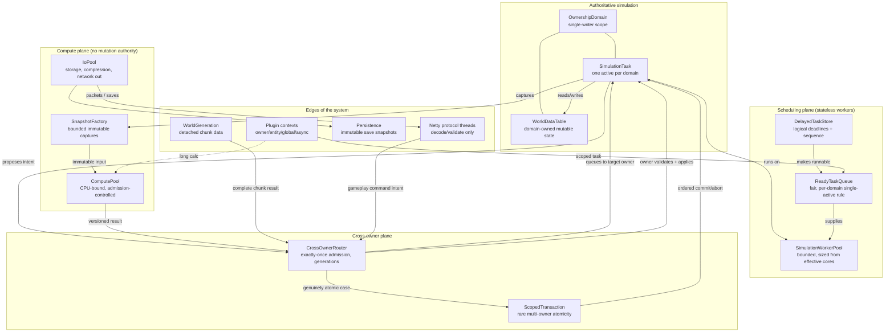
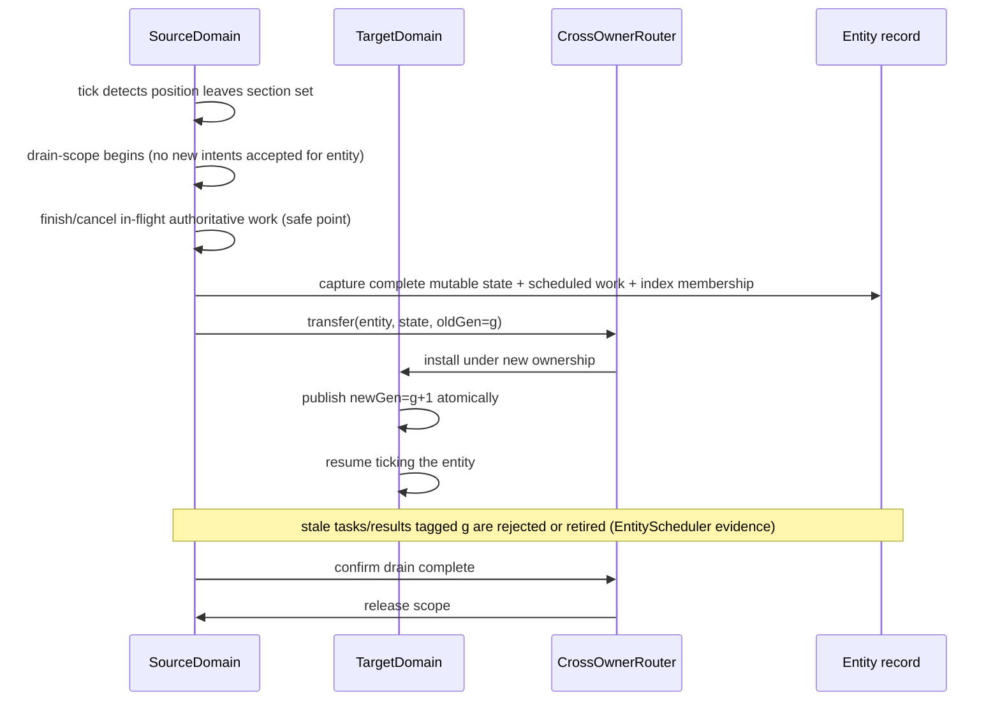

# Torch Concurrency Diagrams (Proposal)

**Status: proposed; awaiting architecture review.** The component dependency graph and the six required lifecycle sequence diagrams (assignment §19). All names are design names; nothing here is implemented. Evidence for every mechanism is in [`FOLIA_FORENSIC_AUDIT.md`](FOLIA_FORENSIC_AUDIT.md); the prose design is [`CONCURRENCY_ARCHITECTURE.md`](CONCURRENCY_ARCHITECTURE.md).

## 1. Component dependency graph



**Forbidden dependencies (enforced by review + assertions):** compute/io/generation pools → direct mutation of `WDT`; `NET` → direct mutation of anything authoritative; `ST` → blocking wait on another domain's task; anything → wait on a future completed by the same saturated pool (`CONCURRENCY_ARCHITECTURE.md` §7 hard prohibitions).

## 2. Sequence: normal entity ticking

```mermaid
sequenceDiagram
    participant P as SimulationWorkerPool
    participant D as OwnershipDomain (entity's region)
    participant W as WorldDataTable
    participant M as Metrics

    P->>D: run scheduled SimulationTask (tick deadline)
    D->>D: acquire (single-writer mark)
    D->>W: read entity state + local block view
    W-->>D: authoritative state
    D->>W: apply movement/damage/AI transition (in domain order)
    D->>W: publish observations (tracking deltas)
    D->>M: record exec time, queue wait, lag
    D->>D: release
    P->>D: next eligible task (any worker; ownership stays with D)
```

## 3. Sequence: a pathfinding task returning to its owner

```mermaid
sequenceDiagram
    participant D as OwnershipDomain (mob's region)
    participant S as SnapshotFactory
    participant C as ComputePool
    participant R as CrossOwnerRouter
    participant W as WorldDataTable

    D->>S: capture bounded snapshot (goal, pose, walkable blocks, gen)
    S-->>D: immutable PathInput{version=gen}
    D->>C: submit PathInput (non-blocking)
    Note over D: domain continues ticking; never waits
    C->>C: A* over the immutable input
    C->>R: PathResult{input version, candidate path}
    D->>R: (tick boundary) poll results for this domain
    R->>D: deliver PathResult
    alt version still current AND entity still owned
        D->>W: validate waypoints against live blocks
        W-->>D: deviations (blocks changed)
        D->>W: adopt path (patched at validation points)
    else stale (entity moved/region changed/world version bumped)
        D->>D: discard; recompute or fall back to straight-line
    end
```

## 4. Sequence: an entity crossing an ownership boundary



## 5. Sequence: a block update crossing a boundary

```mermaid
sequenceDiagram
    participant A as SourceDomain (triggering block)
    participant R as CrossOwnerRouter
    participant B as TargetDomain (affected block)

    A->>A: vanilla update order produces neighbor update for block in B
    A->>R: BlockUpdateIntent{target pos, update kind, seq, gen, redstoneTime}
    Note over A: source order preserved (seq); nothing executes on B's state from A
    R->>B: queue intent (exactly-once admission)
    B->>B: apply in its own update walk at same logical position in order
    alt target unloaded or outside any domain
        B->>B: NOT silently dropped (constraint §2.9):
        B->>R: hold or defer per mechanic (ADR-9), log with context
    end
    Note over A,B: Folia's patch 0004 drops such updates; Torch's stricter rule is ordered delivery or a documented exclusive-scope fallback
```

## 6. Sequence: ownership migration while tasks are pending

```mermaid
sequenceDiagram
    participant SCH as Scheduler
    participant A as OldDomain
    participant B as NewDomain
    participant Q as QueuedTasks/DelayedStore
    participant C as ComputePool

    SCH->>A: mark draining (scope S)
    SCH->>Q: stop admission for S; tag queued tasks oldGen
    A->>A: finish current task to boundary; cancel rest at safe point
    A->>B: transfer full mutable state S (single-writer handoff)
    B->>B: install; bump generation; confirm
    SCH->>Q: revalidate/repoint pending tasks → newGen (or reject if semantically stale)
    SCH->>B: resume scheduling S
    C->>Q: in-flight compute results tagged oldGen → rejected by generation check
    Note over A,B: exactly one authoritative writer at every point; both-resume is a fault-injection test target
```

## 7. Sequence: a save operation during continued simulation

```mermaid
sequenceDiagram
    participant D as OwnershipDomain
    participant S as SnapshotFactory
    participant IO as IoPool
    participant P as Persistence

    D->>D: reach save point (tick boundary; state internally consistent)
    D->>S: capture immutable save snapshot (chunk deltas, entities, block entities)
    S-->>D: Snapshot{version} (bounded copy; D continues ticking)
    D->>IO: hand off snapshot (non-blocking)
    IO->>P: serialize + write
    alt write completes
        P->>D: ack(version) — recorded
    else newer snapshot already acked (version stale)
        P->>P: discard older write (never overwrite newer live state)
    else failure
        P->>D: failure surfaced; domain marks chunk dirty again (retry next cycle)
    end
    Note over D,P: crash consistency claims are out of scope until the storage protocol analysis (design doc §13) is implemented
```
