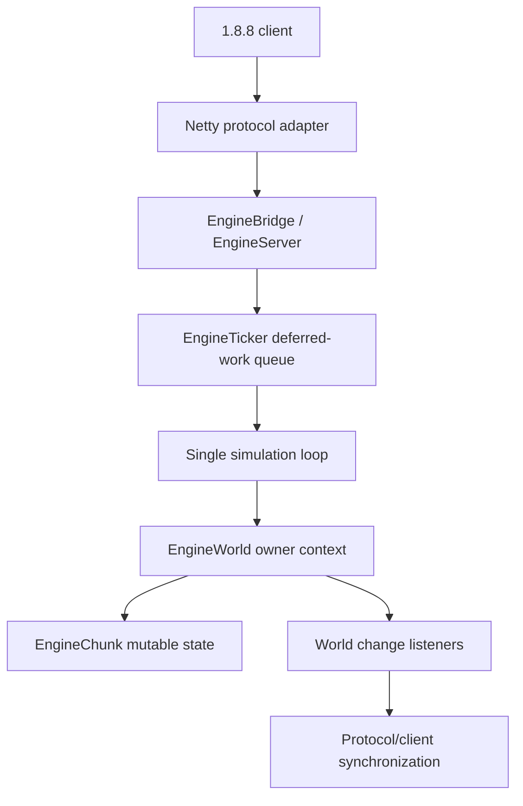

# Minestom and Execution Baseline

**Status: source reconnaissance; not a full call-site audit.** This document records what was verified on `develop` at the time of inspection. It must be refreshed if the branch changes.

## Build and dependency evidence

The repository uses Gradle Kotlin DSL, Java 21 toolchains, and JUnit 5. The modules declared in `settings.gradle.kts` are:

- `:zamin-api`
- `:zamin-core`
- `:zamin-protocol-v1_8_8`
- `:zamin-launcher`

The inspected module build files declare project dependencies between those modules and Netty 4.2.1.Final in the protocol module. No inspected build file declares Minestom. The project is therefore **not currently running on Minestom**, and it would be inaccurate to describe its current execution model as Minestom's threading implementation.

`docs/ENGINEERING_PLAN.md`, section 3 / ADR-0001, explicitly records Minestom integration as deferred. The recorded reasons are the current Minestom release's modern protocol assumptions and the risk of creating a second authoritative world model beside Torch's 1.8.8 world state. This decision should be revisited only with a concrete integration target and evidence that one authoritative state can be maintained.

## Verified runtime components

| Component | Verified responsibility | Concurrency implication |
|---|---|---|
| `zamin-protocol-v1_8_8` | Protocol-47 adapter using Netty | Packet/event-loop threads must hand gameplay mutations to the simulation authority; a network callback is not world ownership |
| `EngineServer` | Lifecycle, world, player registry, protocol bridge | The class comment distinguishes tick-owned world state from identity-critical session operations handled on caller/network contexts; this boundary needs call-site auditing |
| `EngineTicker` | Fixed-rate simulation loop, deferred work queue, world-time advancement, tick handler | One loop currently serializes world progression; missed ticks are skipped, not burst-caught-up |
| `EngineWorld` | Authoritative world/chunk state, block mutations, deltas, world time | Records an owner thread and checks mutation on key methods; concurrent maps do not make chunk values safe for concurrent writes |
| `EngineChunk` | Mutable chunk block/light representation | Must remain under the world/domain authority unless a future immutable snapshot or explicit ownership protocol is added |
| `WorldChangeListener` implementations | Reactions to committed block mutations, including derived updates and client sync | Listener execution inherits the mutation context; any listener that hops threads or re-enters generation needs explicit auditing |
| `WorldStorage` / delta snapshot types | Persistence boundary | Save work should consume a consistent immutable snapshot rather than reading live mutable maps off-thread |

## Current execution path (verified at component level)

This is a component-level map, not proof that every gameplay packet uses the queue. Each packet handler and each bridge callback still needs tracing from its actual call site.

## Ownership enforcement already present

- `EngineTicker` records the running tick thread and exposes `ownerThread()` internally.
- `EngineWorld` stores an owner `Thread`; mutating methods such as `setBlock`, `getOrGenerate`, `applyDeltas`, `snapshotDeltas`, `tickTime`, and `setTimeOfDay` call ownership checks.
- `EngineWorld.peek` is described as a read-only peek safe from any thread, but returning a mutable `EngineChunk` reference is not itself an immutable snapshot or a mutation capability boundary. The caller must not infer permission to inspect nested mutable state without further audit.
- `EngineWorld.loadedChunks()` returns an unmodifiable collection view, not a deep immutable snapshot of chunk state.
- `EngineWorld` uses concurrent maps for chunk publication and delta-map keys, but nested per-chunk delta maps are ordinary mutable maps. Ownership checks, not the map type, are the intended write boundary.

## Known limitations and risks

1. **No spatial ownership model exists in the inspected module set.** There is no verified per-chunk or per-region scheduler in this baseline.
2. **World generation is synchronous.** `getOrGenerate` generates, applies deltas, runs chunk-load listeners, and only then publishes the chunk. Offloading it requires detached inputs/results and generation/version validation.
3. **The tick queue is unbounded.** `ConcurrentLinkedQueue` accepts work without admission control; future overload behavior must be explicit.
4. **A thrown exception aborts the remainder of the current `tickOnce` body.** The ticker catches `Throwable` around the whole drain/time/handler sequence, logs, and continues the next tick. Whether partially drained gameplay work can be lost or leave a subsystem inconsistent must be tested.
5. **Tick metrics are aggregate.** Existing TPS and overrun values cannot reveal per-owner starvation, cross-domain message latency, or compute-pool saturation.
6. **Owner identity is tied to a physical thread today.** This is enforceable for the current single-thread model but must be replaced by a logical execution context before tasks can migrate between workers.
7. **No Minestom API or threading behavior can be claimed from this repository baseline.** If Minestom is integrated later, inspect the exact pinned dependency source/bytecode and trace its actual call sites before making comparisons.

## Required next source traces

- Every protocol handler that mutates player/session/world state, including join, movement, interactions, disconnect, and outbound publication.
- Every caller of `EngineTicker.submit`, including whether queued operations retain mutable references.
- Every `WorldChangeListener` and `ChunkLoadListener`, including exceptions and re-entrancy.
- `EngineServer` shutdown, persistence snapshots, and world save completion paths.
- All uses of `EngineWorld.peek`, `loadedChunks`, and returned `EngineChunk` references.
- The complete Folia archive inventory, which is tracked separately and remains incomplete.
